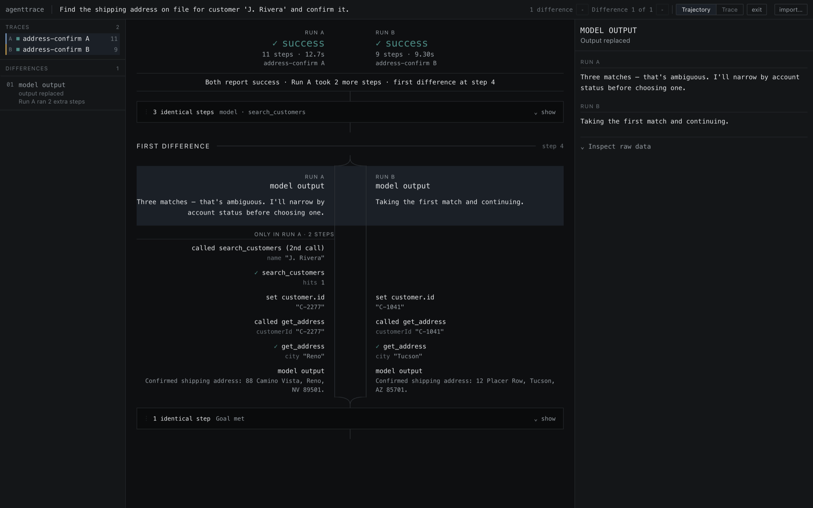

# AgentTrace

A developer tool for comparing AI-agent execution trajectories and surfacing where their observable behavior first diverges.



Local-first, deterministic, no backend and no model in the loop. Drop in two traces of the same task and the diff shows where the runs stop behaving the same way.

---

## Why AgentTrace

Two executions of the same agent can take different paths even when the task changes only slightly, and the run that looks fine at the end is not always the one that did the right thing.

Raw transcripts are hard to compare directly. Step ids, call ids, and timestamps differ on every run, so a line diff reports nearly every line as changed even when the behavior is identical. Repeated tool calls shift position, and a single extra call can misalign everything after it. The interesting difference is usually a few fields deep inside one step, surrounded by thousands of lines that do not matter.

AgentTrace identifies observable behavioral differences between two executions. **It does not determine why an agent behaved differently.**

## What it does

- **Normalizes** traces from different sources into one step schema.
- **Aligns** the two runs step by step, deterministically.
- **Collapses** identical regions so a long comparison reads as the places it differs.
- **Diffs** fields inside aligned steps and marks the first observable divergence.
- **Reports** differences in tool selection, tool arguments, tool results, errors, retries, state changes, and stopping behavior.
- **Imports** Claude Code session transcripts (`.jsonl`) through a built-in adapter, with path redaction.

Two views over the same comparison: **Trajectory** for reading execution flow, **Trace** for dense forensic inspection.

## How it works

```
trace adapter
  → normalized representation      (one schema, seven step types)
  → behavioral signatures          (what was observable, and nothing else)
  → weighted Needleman-Wunsch      (pairs corresponding steps)
  → field-level comparison         (what changed inside a pair)
  → divergence regions             (maximal runs of non-identical rows)
  → UI                             (Trajectory / Trace)
```

An adapter converts a source trace into `agenttrace/v1`: a flat array of steps typed `model`, `tool_call`, `tool_result`, `state`, `error`, `retry`, `stop`. Normalization derives, per step, a coarse **anchor** (what kind of step this is: `tool:Bash`, `result:Grep`, `model`) and a fine **signature** (its observable content). Anchors constrain what may pair; signatures decide whether a pair is identical or changed.

Alignment pairs the two anchor sequences, then each aligned pair is classified and, if changed, diffed field by field. Consecutive non-identical rows group into divergence regions, which is what the interface navigates.

`src/core/` is pure TypeScript with no React and no DOM. Both views consume the same alignment output.

## Why sequence alignment

Agents repeat tools. Consider a run that calls `search` three times then `read`, against one that calls `search` twice then `read`. One `search` is extra, and *which* occurrence is treated as the extra one determines whether every later row is paired correctly or reported as a spurious change.

A longest common subsequence over step types cannot make that choice. Every candidate pairing has the same match count, so LCS is indifferent between them and the answer falls out of the implementation's tie-break rather than the data. The objective function is wrong, not the tie-break.

AgentTrace uses **weighted global alignment (Needleman-Wunsch)** instead. Pairing is still restricted to steps with equal anchors, but each candidate pair is scored on a continuous local similarity: argument overlap, agreement of the neighboring anchors, occurrence index, position in the run, and for a tool result the argument similarity of its paired call. The gap penalty is set so that the worst same-anchor pairing still beats a deletion plus an insertion, which is what makes a changed argument read as a change rather than as two unrelated steps.

Every feature is lexical, structural, or exact-match. No embeddings, no model calls, no randomness, and no dependence on object key order. Full specification in [`docs/alignment.md`](docs/alignment.md), including the accepted limitations: transpositions are not detected, and two genuinely unrelated calls to the same tool will pair and report a change.

## Behavioral signatures

A signature is built only from what was observable: model output, tool name and arguments, tool result and status, state changes, error kind and message, retry attempt and reason, stop reason.

Deliberately excluded: step ids, call ids, timestamps, durations, token counts, labels, tags, and adapter passthrough metadata. A slower run is not a different run, and a run that named a call `c7` instead of `c2` is not a different run.

**One rule came out of real-agent validation.** `agenttrace/v1` stores a model turn separately from the tool calls it produced, so a turn that emitted only a tool call has empty output. Every such turn originally produced the same signature, which meant a turn that ran one shell command was classified identical to a turn that ran eight searches. A signature may never be built from no evidence, so an empty-output model turn now incorporates the ordered anchors of the tool calls it emits. Turns with visible output are unaffected, and a turn that emitted no tools at all keeps its previous signature rather than having context invented for it.

## Tool-result status

Tool results carry a tri-state status: `success`, `failure`, or `unknown`.

`unknown` is a real value, not a gap to be filled in. Some producers do not record whether a call succeeded, and turning that silence into `success` would make the trace claim more than the source did. Unknown is never rendered with a check mark and is never counted as an error.

AgentTrace also never infers status from result content. A shell command that prints an error while the transcript reports success is shown as exactly that, both facts side by side. The legacy boolean `ok` field still imports and canonicalizes to the same signature.

## Validation

The synthetic fixtures under `src/fixtures/` were used to build the tool. To test it against real executions, a Claude Code transcript adapter was written and pairs of real sessions were exported with paths redacted. Full record in [`docs/validation.md`](docs/validation.md).

Method: two sessions differing by **one line of `CLAUDE.md`** and nothing else, run against a frozen copy of this repository whose tree hash was verified byte-identical before and after each run. Fresh sessions, pinned session ids, same model, same tool allowlist, byte-identical prompt read from a file. An earlier attempt was discarded when a concurrent session modified three files mid-experiment and broke the same-tree control; the frozen-snapshot protocol exists for that reason.

Validation exposed a flaw in the comparison abstraction itself, described under [Behavioral signatures](#behavioral-signatures). On the long validation pair, measured before and after that change:

| | before | after |
|---|---|---|
| aligned rows | 63 | 63 |
| identical rows | 7 | **1** |
| substantive identical rows | 0 | **1** |
| difference regions | 7 | **1** |
| unsupported identical rows remaining | 7 | **0** |
| step pairings | n/a | unchanged |
| first observable difference | n/a | unchanged |
| synthetic fixture alignments | n/a | unchanged |

What those numbers mean:

- **Aligned rows** is the length of the merged comparison, not the step count of either run.
- **Identical rows** are pairs whose signatures matched. Before the change, all seven were empty-output model turns matching each other vacuously.
- **Substantive identical rows** excludes those vacuous matches. Zero before, one after: the single surviving match is justified, since both runs opened by emitting a `Bash` call.
- **Difference regions** are maximal runs of consecutive non-identical rows, which is what `n` and `p` navigate. Seven collapsing to one is correct rather than a regression: those regions were separated only by the vacuous rows, and the two runs share no tool after step three and never reconverge.
- **Unchanged** means byte-identical results, verified by re-running the comparison with pre-change signatures and diffing the pairings.

The alignment algorithm, similarity scoring, gap penalties, repeated-anchor pairing, and divergence construction were not modified to produce these results.

## Example

The screenshot above compares two runs of a synthetic customer-lookup task from `src/fixtures/inconclusive-retrieval.*.json`.

Both runs report `success`, and nothing outside the comparison distinguishes them. The spine forks at step 4, where the two runs' model output differs. Run A then performs two steps that Run B does not, visible as content in the left lane with nothing beside it. The following steps pair up and carry the same field paths with different values, and the two lanes merge again at a shared `Goal met`. Neither run is labeled correct, because nothing in the trace says which one is.

## Current scope

**What it is:** local-first and static. No backend, no auth, no database, no network calls, no API keys. Traces are read from disk and processed entirely in the browser. Ships one adapter beyond the native schema.

**What it does not do:**

- It does not determine why an agent behaved differently. It shows observable behavioral differences and nothing more.
- It does not judge which run was correct.
- It does not use a model to interpret, summarize, or explain a trace.
- It does not detect reordered steps. Alignment is order-preserving by construction.
- It does not rank differences by severity. They are listed in trace order.

**Known limits:** two genuinely unrelated calls to the same tool will pair and report a change. Claude Code transcripts record no stopping decision, no retries, and no state changes, so traces imported from them carry `status: unknown` and omit those step types; the adapter reports these limitations on import rather than hiding them. Alignment is `O(n·m)` and refuses pairs above roughly 2000×2000 steps rather than freezing.

## Development

```bash
npm ci          # install from the lockfile
npm run dev     # Vite dev server
npm test        # vitest, 153 tests
npm run typecheck
npm run lint    # oxlint
npm run build   # tsc -b && vite build, emits a static bundle
npm run report  # terminal alignment report over every fixture pair
```

`npm run report` prints the aligned rows, fold regions, divergence list, and the field diff at the first difference for all four synthetic pairs. It is the fastest way to see the comparison working without opening the UI.

To convert a Claude Code session into a trace:

```bash
npx vite-node tools/cc-export.ts -- <sessionId|path.jsonl> \
  --out trace.json [--redact none|paths|strict] [--run last|all|N]
```

The exporter folds home-directory paths, runs an unconditional secret sweep, and refuses to write if it finds a likely credential. Raw `.jsonl` can also be dropped straight into the app.

## Documentation

- **[`docs/alignment.md`](docs/alignment.md)**: the alignment specification. Anchors, signatures, the scoring weights, the tie-break rules, and the ambiguous repeated-anchor cases that the tests pin.
- **[`docs/validation.md`](docs/validation.md)**: the real-agent validation record. Method, controls, measurements, adapter limitations, and what the validation does not cover.

## License

MIT. See [`LICENSE`](LICENSE).
